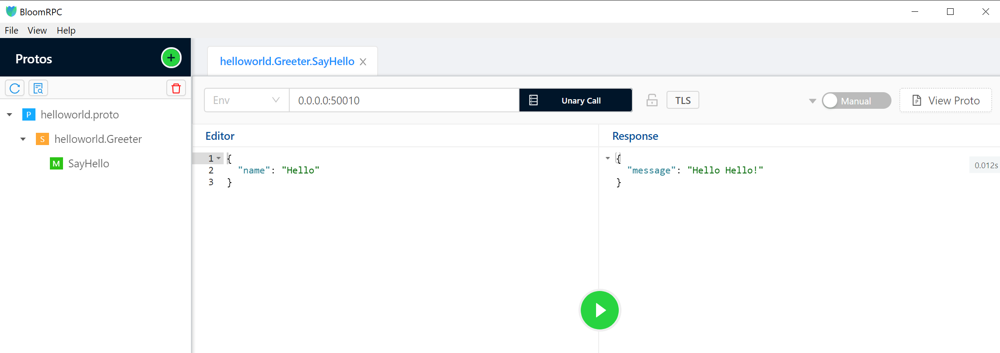

# What we do in this project?

We want to use `dapr` with `dapr-rs`, but also wants to run `actix-web` and other gRPC lib such as `tonic` in the same?

# Why we did that?

`dapr-rust-sdk` is only with very basic sample on `tokio`, but what we want to do is more :) We want to combine all of them together (`dapr` + `actix-web` + `tokio` + `tonic`). Let do it to see how far we can go there :)

# How to run

Make sure you have `dapr` CLI on local machine:

> CLI version: 1.1.0
>
> Runtime version: 1.1.2

```bash
$ dapr init
```

## Run standalone mode

```bash
$  dapr run --app-id rust-subscriber --app-protocol grpc --app-port 50010 --log-level debug cargo run
```

Then

```bash
$ dapr run --app-id rust-publisher --app-protocol grpc --log-level debug cargo run
```

You should see the ping and pong message on the subscriber console!

And you can call `Helloworld` on `50010` - `http2` as well as access to `http://127.0.0.1:8088/index.html` =))



## Run on docker-compose

If you run `dapr` CLI before on your local machine, plz make sure you run

```bash
$ dapr uninstall --all
```

And now run the following commands:

```bash
$ docker-compose build
$ docker-compose up
```

Happy hacking!
